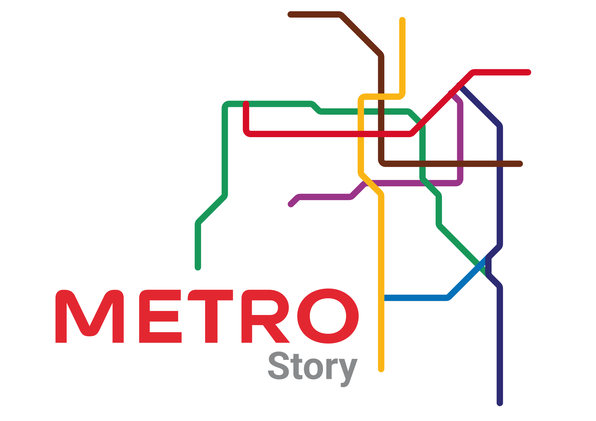

# 🚇 MetroStory: Santiago Subway Adventure

Welcome to MetroStory, your ticket to an interactive journey through the fascinating Santiago subway system! 🌟

Explore the rich history and unique stories behind each station, from the heart of the city to the outskirts. MetroStory transforms your commute into a captivating adventure, offering insights, fun facts, and historic tales about Santiago's iconic subway stations.

## Features

- **Click and Discover:** Dive into the story of each station with a simple click.
- **Station Inauguration Dates:** Learn when each station opened its doors to the public.
- **Daily Passenger Insights:** Find out how many people traverse each station on a daily basis.
- **Quirky Fun Facts:** Unearth entertaining trivia that adds a dash of fun to your subway experience.
- **Historical Personages:** Discover the stories behind stations named after historic figures or significant dates.

## Inspiration

Awesome project that I would love to replicate someday in Santiago de Chile: [Visualizing MBTA Data](https://mbtaviz.github.io/)

SVG structure inspired by [IT Subway Map](https://itsubwaymap.com/interactive-map/)

## Documentation

### Stack

- [Svelte](https://svelte.dev/) - Front-end library
- [TailwindCSS](https://tailwindcss.com/) - Style

### Quick Start

You need to have [NodeJS](https://nodejs.org/en/download/) (V18) and a package manager such as [Yarn](https://yarnpkg.com/lang/en/docs/install/) installed.
Then run the following commands to get started:

1. Run `yarn` to install or update all necessary dependencies.
2. Run `yarn dev` to run it locally. This will keep running to immediately build changed files when they are updated.
